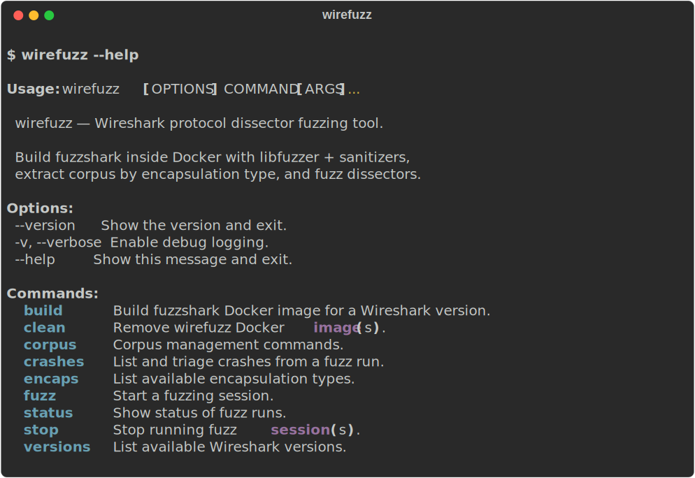
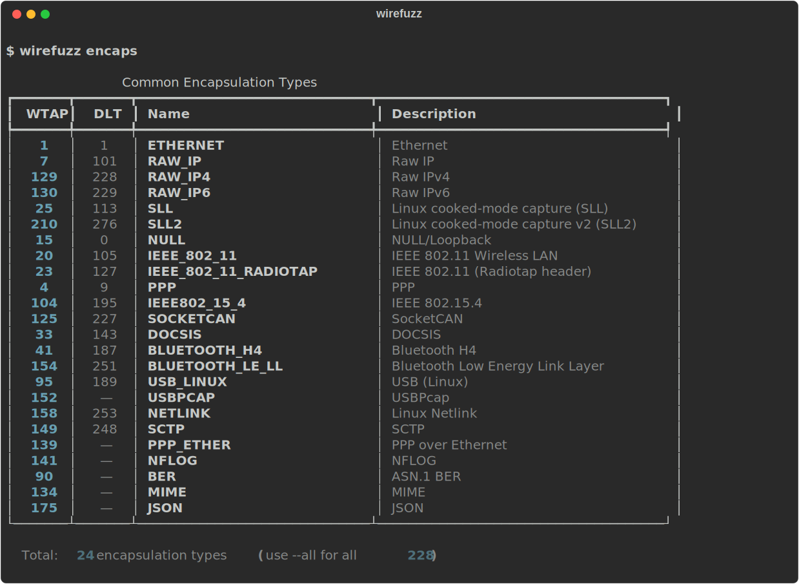
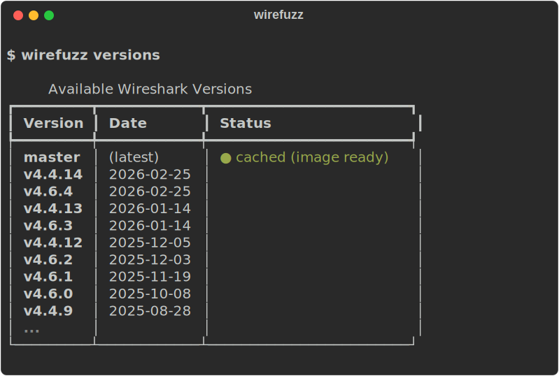
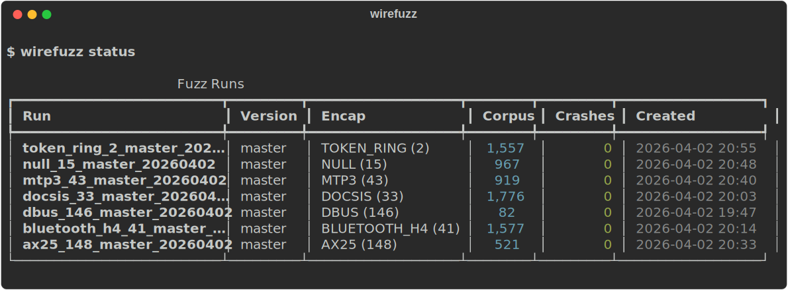
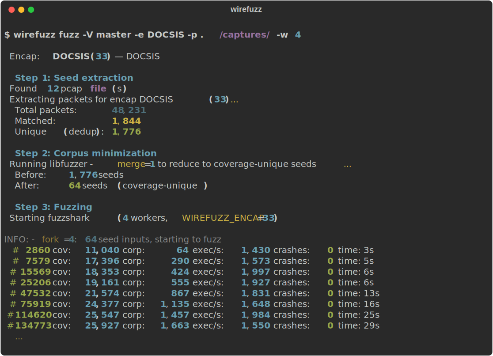

# wirefuzz

A fuzzing framework for Wireshark's 1600+ protocol dissectors. Builds an instrumented `fuzzshark` binary inside Docker with clang, libfuzzer, ASAN, and UBSan, then orchestrates fuzzing campaigns to find memory safety bugs like heap-buffer-overflows, use-after-free, null-pointer dereferences, and undefined behavior.

## Why wirefuzz

Wireshark ships over 1600+ protocol dissectors, each parsing a different wire format. Every dissector is reachable from a captured packet, but only if the packet's **link-layer encapsulation type** matches what the dissector expects. A single pcap file typically contains packets of only one or two encap types, so fuzzing "all of Wireshark" with a random pcap misses most of the attack surface.

wirefuzz solves this by making the encapsulation type a first-class concept throughout the entire pipeline:

1. **Point it at a pile of pcaps** -- you can pass a single file, a directory of captures, or a mix of pcap and pcapng files from different sources. wirefuzz reads them all.
2. **Automatic encap-aware seed extraction** -- each pcap is parsed in pure Python. Every packet is tagged with its encap type (translating pcap DLT numbers to Wireshark's internal WTAP IDs automatically). Only packets matching your target encap are extracted as raw payloads.
3. **Deduplication** -- extracted payloads are hashed (SHA-256) and deduplicated, so identical packets from overlapping captures don't bloat the corpus.
4. **Corpus minimization** -- before fuzzing starts, libfuzzer's `-merge=1` mode runs a coverage pass over the deduplicated seeds and keeps only those that contribute unique coverage edges. A corpus of 120,000 raw packets might shrink to a few thousand that actually matter.
5. **Targeted fuzzing** -- the minimized corpus feeds into `fuzzshark` running inside Docker with the `WIREFUZZ_ENCAP` environment variable set, so every generated input is parsed by exactly the dissector you chose -- not discarded by the encap check.

This means you can throw a terabyte of mixed captures at wirefuzz and get a tight, deduplicated, coverage-minimized corpus for any of the 228 supported encap types, then fuzz that specific dissector with full ASAN + UBSan instrumentation.

```
 Multiple pcap/pcapng files (any source, any mix of encap types)
              |
              v
    +----- Parse & tag each packet with its WTAP encap type -----+
    |         (DLT-to-WTAP translation handled automatically)     |
    +-------------------------------------------------------------+
              |
              v
    Filter: keep only packets matching target encap (e.g. DOCSIS = WTAP 33)
              |
              v
    Deduplicate by SHA-256 (remove identical payloads)
              |
              v
    Corpus minimization via libfuzzer -merge=1
    (keep only seeds that add unique coverage edges)
              |
              v
    Fuzz with fuzzshark (WIREFUZZ_ENCAP=33, fork mode, N workers)
              |
              v
    Crashes, coverage, live stats
```

## Screenshots

### Main help

<p align="center"></p>

### Encapsulation types (`wirefuzz encaps`)

<p align="center"></p>

### Version management (`wirefuzz versions`)

<p align="center"></p>

### Run dashboard (`wirefuzz status`)

<p align="center"></p>

### Fuzzing session — full pipeline

Shows the complete flow: seed extraction from pcaps, deduplication, corpus minimization, and fuzzing with live coverage stats.

<p align="center"></p>

## Table of Contents

- [Screenshots](#screenshots)
- [Features](#features)
- [Requirements](#requirements)
- [Installation](#installation)
- [Quick Start](#quick-start)
- [Commands](#commands)
  - [build](#build)
  - [fuzz](#fuzz)
  - [status](#status)
  - [crashes](#crashes)
  - [stop](#stop)
  - [corpus](#corpus)
  - [bisect](#bisect)
  - [versions](#versions)
  - [encaps](#encaps)
  - [clean](#clean)
- [DLT vs WTAP Encap IDs](#dlt-vs-wtap-encap-ids)
- [Architecture](#architecture)
- [Run Directory Layout](#run-directory-layout)
- [Docker Internals](#docker-internals)

## Features

- **Encap-first design** -- the entire pipeline (seed extraction, dedup, minimization, fuzzing) is organized around link-layer encapsulation types. Pick any of 228 WTAP encap types and wirefuzz builds a targeted corpus and fuzzing session for that specific dissector.
- **Multi-source corpus pipeline** -- point `-p` at any mix of pcap/pcapng files or directories. wirefuzz parses them all, extracts packets matching the target encap, deduplicates by SHA-256, minimizes via libfuzzer coverage, and produces a tight seed corpus -- fully automated.
- **Docker-based builds** -- compiles `fuzzshark` at any Wireshark version (tags, branches, commits) with clang + libfuzzer + ASAN + UBSan. Supports incremental builds via Docker layer caching.
- **228 encapsulation types** -- full WTAP registry with automatic DLT-to-WTAP translation and interactive fuzzy picker. Covers everything from Ethernet and 802.11 to DOCSIS, CAN bus, Bluetooth LE, USB, and dozens more.
- **Automatic corpus minimization** -- pre-fuzz pass using libfuzzer's `-merge=1` reduces seeds to only those that contribute unique coverage edges. 120K raw packets can shrink to a few thousand.
- **Crash triage** -- deduplication, classification (heap-overflow, UAF, null-deref, double-free, UB), ASAN stack trace extraction, markdown report generation.
- **Live monitoring** -- real-time stats (exec/s, coverage edges, corpus size, crashes, RSS).
- **Version management** -- fetches Wireshark releases from GitLab API, caches locally, shows which versions have cached Docker images.
- **Crash bisection** -- binary search across Wireshark versions to find the commit that introduced a bug.
- **Dictionary support** -- built-in protocol magic bytes and optional extraction from dissector source code.
- **Coverage tracking** -- collects SanitizerCoverage (sancov) data per run.

## Requirements

- Python 3.8+
- Docker (daemon must be running)

## Installation

```bash
pip install -e .
```

## Quick Start

```bash
# 1. Build fuzzshark for Wireshark master (or any version/tag)
wirefuzz build master

# 2. Fuzz the DOCSIS dissector
#    -p accepts a file, a directory, or multiple directories of pcap/pcapng files.
#    wirefuzz will: parse all pcaps -> extract only DOCSIS packets -> dedup by
#    SHA-256 -> minimize corpus via coverage -> launch fuzzshark with ASAN+UBSan.
wirefuzz fuzz -V master -e DOCSIS -p ./captures/ -w 8

# 3. Monitor progress (live exec/s, coverage, crashes)
wirefuzz status ./wirefuzz_runs/docsis_33_master_20260401_143022/

# 4. Triage crashes
wirefuzz crashes ./wirefuzz_runs/docsis_33_master_20260401_143022/

# 5. Find which version introduced a crash
wirefuzz bisect --crash ./crash-abc123 --good v4.4.6 --bad master
```

All options support interactive mode -- omit any flag and wirefuzz will prompt you with a picker. Omit `-e` with a `-p` and wirefuzz will probe the pcaps, show the encap distribution, and let you pick which dissector to fuzz.

## Commands

### build

Build the fuzzshark Docker image for a Wireshark version.

```bash
wirefuzz build master          # build from master branch
wirefuzz build v4.6.4          # build a specific release tag
wirefuzz build                 # interactive version picker
```

| Flag | Description |
|------|-------------|
| `-j, --jobs N` | Parallel build jobs (0 = auto) |
| `--no-cache` | Force rebuild without Docker cache |

First build takes 15-30 minutes. Subsequent builds of the same version are instant (Docker layer cache). Images are tagged `wirefuzz:<version>`.

### fuzz

Start a fuzzing session.

```bash
wirefuzz fuzz -V master -e ETHERNET -p ./captures/ -w 16
wirefuzz fuzz -V v4.6.4 -e 33 -p ./docsis_pcaps/ --duration 2h
wirefuzz fuzz --resume ./wirefuzz_runs/ethernet_1_master_20260401_143022/
wirefuzz fuzz                  # fully interactive
```

| Flag | Description | Default |
|------|-------------|---------|
| `-V, --version` | Wireshark version (tag, branch, or commit) | interactive |
| `-e, --encap` | Encap type by ID or name (e.g. `1`, `ETHERNET`) | interactive |
| `-p, --pcap` | PCAP file or directory for seed corpus | empty corpus |
| `-w, --workers` | libfuzzer fork-mode workers | 4 |
| `-o, --output` | Output base directory | `wirefuzz_runs/` |
| `-t, --timeout` | Per-input timeout in ms | 5000 |
| `--rss-limit` | RSS memory limit per worker in MB | 4096 |
| `--max-len` | Max input length in bytes | 65535 |
| `--duration` | Max run time (`2h`, `30m`, `forever`) | unlimited |
| `--dict` | Path to libfuzzer dictionary file | none |
| `--mount-source` | Mount host Wireshark source for incremental builds | none |
| `--resume` | Resume a previous run directory | none |
| `--no-cache` | Force rebuild Docker image before fuzzing | false |

When `-p` is provided, wirefuzz probes the pcap files to show the encap type distribution before prompting for selection (if `-e` is omitted).

### status

Monitor fuzz runs.

```bash
wirefuzz status                # list all runs with summary
wirefuzz status ./wirefuzz_runs/docsis_33_master_20260401_143022/  # live stats
```

Without arguments, lists all runs under `wirefuzz_runs/`. With a run directory, shows live stats including exec/s, coverage, corpus size, and crashes.

### crashes

List and triage crashes from a fuzz run.

```bash
wirefuzz crashes ./wirefuzz_runs/docsis_33_master_20260401_143022/
```

Deduplicates crashes by content hash, classifies crash types from ASAN output, extracts top stack frames, and displays reproduction commands.

### stop

Stop running fuzz sessions.

```bash
wirefuzz stop ./wirefuzz_runs/docsis_33_master_20260401_143022/
wirefuzz stop --all            # stop all running wirefuzz containers
```

### corpus

Corpus management subcommands.

#### corpus prepare

Extract packets from PCAPs into raw corpus files.

```bash
wirefuzz corpus prepare -p ./captures/ -e ETHERNET -o ./corpus_ethernet/
wirefuzz corpus prepare -p capture.pcapng -e 33 -o ./corpus_docsis/
```

Parses pcap/pcapng files, filters by encap type, deduplicates by SHA-256, and writes each unique packet payload as a raw file.

#### corpus merge

Merge matching packets into a single pcapng file.

```bash
wirefuzz corpus merge -p ./captures/ -e DOCSIS -o docsis_merged.pcapng
wirefuzz corpus merge -p ./raw_corpus/ -e ETHERNET -o merged.pcapng  # from raw files
```

Accepts either pcap files or raw corpus directories as input.

### bisect

Binary search to find which Wireshark version introduced a crash.

```bash
wirefuzz bisect --crash ./crash-abc123 --good v4.4.6 --bad master
```

Builds and tests each midpoint version automatically, narrowing down to the introducing commit.

### versions

List available Wireshark versions.

```bash
wirefuzz versions              # stable releases only
wirefuzz versions --all        # include release candidates
wirefuzz versions --refresh    # force refresh from GitLab API
```

Versions with a cached Docker image are marked so you can see which are ready to fuzz immediately.

### encaps

List supported encapsulation types.

```bash
wirefuzz encaps                # common types only (24 most-used)
wirefuzz encaps --all          # all 228 types
```

### clean

Remove wirefuzz Docker images.

```bash
wirefuzz clean master          # remove a specific version
wirefuzz clean --all           # remove all wirefuzz images
wirefuzz clean                 # list cached images
```

## DLT vs WTAP Encap IDs

pcap/pcapng files store a **DLT** (Data Link Type) number to identify the link-layer type. Wireshark uses its own internal **WTAP encap** IDs. These are different numbering schemes -- they overlap for a few common types but diverge for most others.

| Protocol | DLT (pcap header) | WTAP (wirefuzz `-e`) |
|----------|-------------------|----------------------|
| Ethernet | 1 | 1 |
| NULL/Loopback | 0 | 15 |
| DOCSIS | 143 | 33 |
| Linux cooked (SLL) | 113 | 25 |
| IEEE 802.11 Radiotap | 127 | 23 |
| USB Linux | 189 | 95 |
| Bluetooth LE LL | 251 | 154 |
| SLL2 | 276 | 210 |

wirefuzz always uses **WTAP encap IDs** for the `-e` flag and in `wirefuzz encaps` output. The DLT-to-WTAP conversion happens automatically when reading pcap files, based on the mapping from Wireshark's `wiretap/pcap-common.c`.

## Architecture

```
wirefuzz/
  cli.py              Click-based CLI, all commands
  fuzzer.py            Fuzzing session orchestration, corpus management
  corpus.py            PCAP/PCAPNG parsing, packet extraction, DLT-to-WTAP mapping
  encaps.py            WTAP encap registry (228 types), interactive picker
  docker.py            Docker image build and container management
  versions.py          Wireshark version management, GitLab API, tag caching
  monitor.py           libfuzzer output parsing, live stats
  crashes.py           Crash dedup, classification, ASAN parsing, reports
  dashboard.py         Run directory management, metadata I/O
  dictionary.py        Protocol-specific fuzzing dictionary generation
  coverage.py          Coverage data collection via sancov
  bisect.py            Binary search for crash-introducing version
  config.py            Configuration defaults
  exceptions.py        Typed exception hierarchy

docker/
  fuzzshark.c          Patched fuzzshark with WIREFUZZ_ENCAP env var support
  entrypoint.sh        Container entrypoint (fuzz, build, minimize, reproduce)
  patch_ninja.py       aarch64 UBSan linker workaround
```

## Run Directory Layout

Each fuzzing session creates a timestamped directory:

```
wirefuzz_runs/
  docsis_33_master_20260401_143022/
    corpus/            seed corpus files (post-minimization)
    crashes/           crash artifacts (crash-*, timeout-*, oom-*)
    logs/
      fuzz.log         libfuzzer output
      minimize.log     corpus minimization output
    coverage/          sancov coverage data
    run.json           run metadata (version, encap, config, corpus stats)
    status.json        live stats (updated during fuzzing)
```

The directory name encodes `{encap_name}_{encap_id}_{version}_{timestamp}`.

## Docker Internals

The Dockerfile builds a single image tagged `wirefuzz:<version>`:

- **Base**: Ubuntu 24.04
- **Compiler**: clang + lld with libfuzzer, ASAN, UBSan
- **Targets**: only `fuzzshark`, `editcap`, and `tshark` (not the GUI)
- **Encap patch**: `docker/fuzzshark.c` replaces upstream to add `WIREFUZZ_ENCAP` env var support, allowing a specific dissector to be targeted without recompilation

Container environment variables:

| Variable | Default | Description |
|----------|---------|-------------|
| `WIREFUZZ_ENCAP` | 32767 | WTAP encap ID to fuzz |
| `WIREFUZZ_WORKERS` | 4 | libfuzzer fork workers |
| `WIREFUZZ_MAX_LEN` | 65535 | Max input length (bytes) |
| `WIREFUZZ_TIMEOUT` | 5 | Per-input timeout (seconds) |
| `WIREFUZZ_RSS_LIMIT` | 4096 | RSS limit per worker (MB) |
| `WIREFUZZ_DURATION` | 0 | Max duration in seconds (0 = unlimited) |
